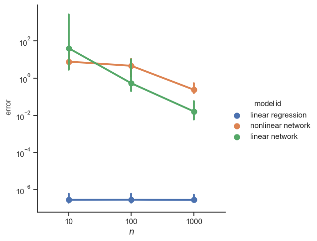

# DynaDojo
DynaDojo is a playground for testing models in dynamical system idenficiation. 

By iteratively adjusting the number of sample and testing performance generalizes, the platform lets you evaluate your model on a growing number of dynamical systems.

## Table of Contents

- [Installation](#installation)
- [Challenges](#challenges)
- [Systems](#systems)
- [Models](#models)
- [Citing](#citing)
- [License](#license)

## Installation

You can install DynaDojo with `pip`.

```shell
pip install dynadojo
```

# Challenges
## Pre-Built Challenges

`DynaDojo` comes with three off-the-shelf challenges: `FixedError`, `FixedComplexity`, and `FixedTrainSize`. More information about each can be found in the paper.

### Examples
For demonstrations, please see:
* [Fixed Error](demos/fixed_error_demo.ipynb)
* [Fixed Complexity](demos/fixed_complexity_demo.ipynb)
* [Fixed Train Size](demos/fixed_train_size_demo.ipynb)

```python
from dynadojo.systems import LDSSystem
from dynadojo.baselines import LinearRegression, DNN
from dynadojo.challenges import FixedComplexity
import pandas as pd


challenge = FixedComplexity(
    N=[10, 100, 1000],  # number of training examples
    l=3,  # latent dimension
    e=3,  # embed dimension
    t=50,  # timesteps
    control_horizons=0,
    max_control_cost_per_dim=0,
    system_cls=LDSSystem,
    reps=10,
    test_examples=50,
    test_timesteps=50,
)
data1 = challenge.evaluate(LinearRegression, id="linear regression")
data2 = challenge.evaluate(DNN, model_kwargs={"activation": "relu"}, fit_kwargs={"epochs": 20}, id="nonlinear network")
data3 = challenge.evaluate(DNN, fit_kwargs={"epochs": 20}, id="linear network")
data = pd.concat((data1, data2, data3))
challenge.plot(data)
```
<b>Out:</b>
<p align="center">

</p>


# Systems

## Pre-Build Systems

DynaDojo comes with [TODO] pre-built systems:
1. [Cellular Automata](dynadojo/systems/ca.py)
2. [Threshold Linear Networks](dynadojo/systems/ctln.py)
3. [N-Body Systems](dynadojo/systems/santi.py)
4. [Linear Dynamical Systems](dynadojo/systems/lds.py)
5. [Generalized Lorenz](dynadojo/systems/lorenz.py)
6. [Spiking Neural Network](dynadojo/systems/snn.py)
7. [Lotka-Volterra Predictor-Prey](dynadojo/systems/lv/prey_predator.py)
8. [Lotka-Volterra Competitive](dynadojo/systems/lv/competitive.py)

## Adding Systems

To add new systems to `DynaDojo`, you must subclass from `AbstractSystem`. Some skeleton code is provided below.

```python
import numpy as np

from dynadojo.abstractions import AbstractSystem


class MySystem(AbstractSystem):
    def make_init_conds(self, n: int, in_dist=True) -> np.ndarray:
        pass

    def make_data(self, init_conds: np.ndarray, control: np.ndarray, timesteps: int, noisy=False) -> np.ndarray:
        pass

    def calc_error(self, x, y) -> float:
        pass

    def calc_control_cost(self, control: np.ndarray) -> np.ndarray:
        pass

    def __init__(self, latent_dim, embed_dim):
        super().__init__(latent_dim, embed_dim)
```

Documentation for each of the abstract methods can be found in [dynadojo/abstractions](dynadojo/abstractions.py). For controlled systems, developers must also implement the `act` method.

To verify that your system works, try using the `tester.py` module.


## Examples
### Example 1: Comparing DNN activations on LDSs

Nonlinearity is a hallmark of modern deep learning; however, there are some exceptional tasks where linear models actually outperform nonlinear neural networks. In this example, we explore this phenomena through linear dynamical systems (LDSs) and deep neural networks (DNNs).

To start, let's create some LDS data using one of DynaDojo's off-the-shelf `LDSSystem`.

```python
import dynadojo as dd
import numpy as np

latent_dim = 5
embed_dim = 10
n = 5000
timesteps = 50
system = dd.systems.LDSSystem(latent_dim, embed_dim)
x0 = system.make_init_conds(n)
y0 = system.make_init_conds(30, in_dist=False)
x = system.make_data(x0, control=np.zeros((n, timesteps, embed_dim)), timesteps=timesteps)
y = system.make_data(y0, control=np.zeros((n, timesteps, embed_dim)), timesteps=timesteps)
dd.utils.lds.plot([x, y], target_dim=min(latent_dim, 3), labels=["in", "out"], max_lines=15)
```

In the image below, observe how the in distribution trajectories (blue) have a different evolution than the out-of-distribution trajectories (orange). A robust model should be able to predict the orange trajectories even if it's only trained on the blue ones.

<p align="center">

</p>

Next, let's create our nonlinear model using DynaDojo's baseline `DNN` class.

```python
nonlinear_model = dd.baselines.DNN(embed_dim, timesteps, activation="tanh", max_control_cost=0)
nonlinear_model.fit(x, epochs=10, verbose='auto')
x_pred = nonlinear_model.predict(x[:, 0], 50)
y_pred = nonlinear_model.predict(y[:, 0], 50)
dd.utils.lds.plot([x_pred, y_pred], target_dim=min(3, latent_dim), labels=["in pred", "out pred"], max_lines=15)
x_err = system.calc_error(x, x_pred)
y_err = system.calc_error(y, y_pred)
print(f"{x_err=}")
print(f"{y_err=}")
```

<b>Out:</b>
```
x_err=203.1404201824185
y_err=346.67112531011145
```

As we can see, the model performs pretty badly. With 10 epochs of training, it struggles to predict both the in and out-of-distribution trajectories!

<p align="center">

</p>

Next, let's try `DNN` with a linear activation.

```python
linear_model = dd.baselines.DNN(embed_dim, timesteps, activation=None, max_control_cost=0)
linear_model.fit(x, epochs=10, verbose='auto')
x_pred = linear_model.predict(x[:, 0], 50)
y_pred = linear_model.predict(y[:, 0], 50)
dd.utils.lds.plot([x_pred, y_pred], target_dim=min(3, latent_dim), labels=["in pred", "out pred"], max_lines=15)
x_err = system.calc_error(x, x_pred)
y_err = system.calc_error(y, y_pred)
print(f"{x_err=}")
print(f"{y_err=}")
```
<b>Out:</b>
```
x_err=21.46598299085367
y_err=243.8198349312669
```

As we can see, the linear model does much better! This is because linear models learn linear dynamics faster.

<p align="center">

</p>

# Models

## Baselines

DynaDojo comes with six baseline models:
1. [CNN](dynadojo/baselines/cnn.py)
2. [DMD](dynadojo/baselines/dmd.py) from the paper "Dynamic mode decomposition of numerical and experimental data"
3. [DNN](dynadojo/baselines/dnn.py)
4. [LPR](dynadojo/baselines/lpr.py)
5. [LR](dynadojo/baselines/lr.py)
6. [SINDy](dynadojo/baselines/sindy.py) from the paper "Discovering governing equations from data by sparse identification of nonlinear dynamical systems"

## Adding Models
Adding new models is simple with DynaDojo. The developer simply needs to implement two abstract methods `fit` and `predict`. If the model uses control, then the developer should also implement `act`. Skeleton code is provided below.

```python
import numpy as np

from dynadojo.abstractions import AbstractModel


class MyModel(AbstractModel):
    def __init__(self, embed_dim: int, timesteps: int, max_control_cost: float, **kwargs):
        super().__init__(embed_dim, timesteps, max_control_cost, **kwargs)
        
    def fit(self, x: np.ndarray, **kwargs) -> None:
        pass

    def predict(self, x0: np.ndarray, timesteps: int, **kwargs) -> np.ndarray:
        pass
    
    def act(self, x: np.ndarray, **kwargs) -> np.ndarray:
        pass
```

## Citing

```angular2html

```

## License

This software is made available under the terms of the MIT license. See LICENSE for details.

The external dependencies used by this software are available under a variety of different licenses. Review these external licenses before using the software.
