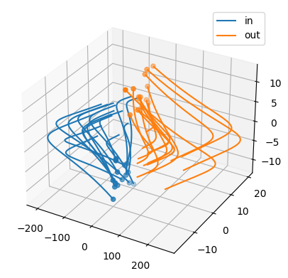
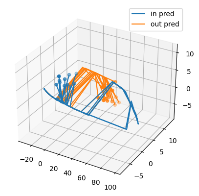
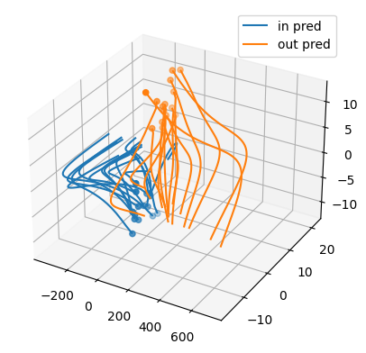

DynaDojo is a Python API for testing how models generalize and efficiently use samples in dynamical system identification. Our platform lets you understand how a model performs as various parameters are adjusted, including tuning the complexity of the system (e.g., dimension), increasing the dataset size, changing the number of timesteps per trajectory, control, adding noise, adjusting the distribution of initial conditions, and more.

You can install DynaDojo with `pip`:

```shell
pip install dynadojo
```

## Introduction
There are three ways to interact with DynaDojo and users can take on multiple "hats" at a time. You can add new dynamical [Systems](#systems) to the platform, create set environments for adjusting parameters in a [Challenge](#challenges), or implement your [Model](#models) with our API to understand how it performs. Most of the platform is adjustable through various parameters in these clases.


## Challenges


`DynaDojo` comes with three off-the-shelf challenges: [Fixed Error](demos/fixed_error_demo.ipynb), [Fixed Complexity](demos/fixed_complexity_demo.ipynb), and [Fixed Train Size](demos/fixed_train_size_demo.ipynb).

```python
from dynadojo.systems import LDSSystem
from dynadojo.baselines import LinearRegression, DNN
from dynadojo.challenges import FixedComplexity
import pandas as pd

challenge = FixedComplexity(
    N=[10, 100, 1000],  # number of training examples
    l=3,  # latent dimension
    e=3,  # embed dimension
    t=50,  # timesteps
    control_horizons=0,
    max_control_cost_per_dim=0,
    system_cls=LDSSystem,
    trials=10,
    test_examples=50,
    test_timesteps=50,
)
data1 = challenge.evaluate(LinearRegression, id="linear regression")
data2 = challenge.evaluate(DNN, algo_kwargs={"activation": "relu"}, fit_kwargs={"epochs": 20}, id="nonlinear network")
data3 = challenge.evaluate(DNN, fit_kwargs={"epochs": 20}, id="linear network")
data = pd.concat((data1, data2, data3))
challenge.plot(data)
```
<b>Out (Fixed Complexity, C = latent_dim = 5):</b>
Note how for this LDSSystem, a linear network learns more from each added sample (larger decreases in error) than a nonlinear network, and how linear regression immediately saturates at very low error. These dynamics help contextualize model performance and comparision.

<p align="center">

</p>


## Systems

<p align="center">

</p>

DynaDojo comes with 20 pre-built systems (including ODEs and PDEs) that range from mature mathematic simulations, to bounded confidence opinion dynamics, biology, ecology, and epidemology:
1. [Cellular Automata](dynadojo/systems/ca.py)
2. [Threshold Linear Networks](dynadojo/systems/ctln.py)
3. [N-Body Systems](dynadojo/systems/santi.py)
4. [Linear Dynamical Systems (LDS)](dynadojo/systems/lds.py)
5. [Generalized Lorenz](dynadojo/systems/lorenz.py)
6. [Spiking Neural Network (SNN)](dynadojo/systems/snn.py)
7. [Kuramoto N-Oscillators](dynadojo/systems/kuramoto.py)
8. [Generalized Prey-Predator](dynadojo/systems/lv/prey_predator.py)
9. [Competitive Lotka Volterra](dynadojo/systems/lv/competitive.py)
10. [Deffuant](dynadojo/systems/opinion/deffuant.py)     
11. [Algorithmic Bias with Media Influence](dynadojo/systems/opinion/media_bias.py)  
12. [Hegselmann-Krause (HK)](dynadojo/systems/opinion/hk.py)  
13. [Weighted Hegselmann-Krause (WHK)](dynadojo/systems/opinion/whk.py)  
14. [Attraction-Repulsion Weighted Hegselmann-Krause (ARWHK)](dynadojo/systems/opinion/arwhk.py)
15. [SIR: Susceptible/Infected/Removed](dynadojo/systems/epidemic/sir.py)  
16. [SIS: Susceptible/Infected/Susceptible](dynadojo/systems/epidemic/sis.py)  
17. [SEIS: Susceptible/Exposed/Infected/Susceptible](dynadojo/systems/epidemic/seis.py)  
18. [2D Heat Equation](dynadojo/systems/heat.py)
19. [Black-Scholes-Barenblatt (BSB)](dynadojo/systems/fbsnn_pde/bsb.py)
20. [Hamilton-Jacobi-Bellman (HJB)](dynadojo/systems/fbsnn_pde/hjb.py)

### Adding Systems

To add new systems to `DynaDojo`, you subclass from `AbstractSystem` and implement the required functions listed below. It is easy to build a System from scratch, or to use existing packages like `scipy` and `NDLIB` and wrap them for our API.

```python
import numpy as np

from dynadojo.abstractions import AbstractSystem


class MySystem(AbstractSystem):
    def make_init_conds(self, n: int, in_dist=True) -> np.ndarray:
        pass

    def make_data(self, init_conds: np.ndarray, control: np.ndarray, timesteps: int, noisy=False) -> np.ndarray:
        pass

    def calc_error(self, x, y) -> float:
        pass

    def calc_control_cost(self, control: np.ndarray) -> np.ndarray:
        pass

    def __init__(self, latent_dim, embed_dim):
        super().__init__(latent_dim, embed_dim)
```

Documentation for each of the abstract methods can be found in [dynadojo/abstractions](dynadojo/abstractions.py). Use `tester.py` to verify that your new system accurately integrates with DynaDojo.


# Models
DynaDojo comes with six **baseline** models:
1. [CNN](dynadojo/baselines/cnn.py)
2. [DMD](dynadojo/baselines/dmd.py) (Schmid, Peter J., "Dynamic mode decomposition of numerical and experimental data")
3. [DNN](dynadojo/baselines/dnn.py)
4. [Lowest Possible Radius (LPR)](dynadojo/baselines/lpr.py)
5. [Linear Regression (LR)](dynadojo/baselines/lr.py)
6. [SINDy](dynadojo/baselines/sindy.py) (Brunton, Steven L., Joshua L. Proctor, and J. Nathan Kutz., "Discovering governing equations from data by sparse identification of nonlinear dynamical systems")

## Adding Models
Adding new models is simple with DynaDojo. The developer simply needs to implement two abstract methods `fit` and `predict`. A model can also optionally use control with the `act` method.

```python
import numpy as np

from dynadojo.abstractions import AbstractModel


class MyModel(AbstractModel):
    def __init__(self, embed_dim: int, timesteps: int, max_control_cost: float, **kwargs):
        super().__init__(embed_dim, timesteps, max_control_cost, **kwargs)
        
    def fit(self, x: np.ndarray, **kwargs) -> None:
        pass

    def predict(self, x0: np.ndarray, timesteps: int, **kwargs) -> np.ndarray:
        pass

    #optional, used when control desired
    def act(self, x: np.ndarray, **kwargs) -> np.ndarray:
        pass
```


## Examples
### Example 1: Comparing DNN activations on LDS

Nonlinearity is a hallmark of modern deep learning; however, there are some exceptional tasks where linear models actually outperform nonlinear neural networks. In this example, we explore this phenomena through linear dynamical systems (LDS) and deep neural networks (DNNs).

To start, let's create some LDS data using one of DynaDojo's off-the-shelf `LDSSystem`.

```python
import dynadojo as dd
import numpy as np

latent_dim = 5
embed_dim = 10
n = 5000
timesteps = 50
system = dd.systems.LDSSystem(latent_dim, embed_dim)
x0 = system.make_init_conds(n)
y0 = system.make_init_conds(30, in_dist=False)
x = system.make_data(x0, control=np.zeros((n, timesteps, embed_dim)), timesteps=timesteps)
y = system.make_data(y0, control=np.zeros((n, timesteps, embed_dim)), timesteps=timesteps)
dd.utils.lds.plot([x, y], target_dim=min(latent_dim, 3), labels=["in", "out"], max_lines=15)
```

In the image below, observe how the in distribution trajectories (blue) have a different evolution than the out-of-distribution trajectories (orange). A robust model should be able to predict the orange trajectories even if it's only trained on the blue ones.

<p align="center">

</p>

Next, let's create our nonlinear model using DynaDojo's baseline `DNN` class.

```python
nonlinear_model = dd.baselines.DNN(embed_dim, timesteps, activation="tanh", max_control_cost=0)
nonlinear_model.fit(x)
x_pred = nonlinear_model.predict(x[:, 0], 50)
y_pred = nonlinear_model.predict(y[:, 0], 50)
dd.utils.lds.plot([x_pred, y_pred], target_dim=min(3, latent_dim), labels=["in pred", "out pred"], max_lines=15)
x_err = system.calc_error(x, x_pred)
y_err = system.calc_error(y, y_pred)
print(f"{x_err=}")
print(f"{y_err=}")
```

<b>Out:</b>
```
x_err=203.1404201824185
y_err=346.67112531011145
```

As we can see, the model performs pretty badly. With 10 epochs of training, it struggles to predict both the in and out-of-distribution trajectories!

<p align="center">

</p>

Next, let's try `DNN` with a linear activation.

```python
linear_model = dd.baselines.DNN(embed_dim, timesteps, activation=None, max_control_cost=0)
linear_model.fit(x)
x_pred = linear_model.predict(x[:, 0], 50)
y_pred = linear_model.predict(y[:, 0], 50)
dd.utils.lds.plot([x_pred, y_pred], target_dim=min(3, latent_dim), labels=["in pred", "out pred"], max_lines=15)
x_err = system.calc_error(x, x_pred)
y_err = system.calc_error(y, y_pred)
print(f"{x_err=}")
print(f"{y_err=}")
```
<b>Out:</b>
```
x_err=21.46598299085367
y_err=243.8198349312669
```

As we can see, the linear model does much better! This is because linear models learn linear dynamics faster.

<p align="center">

</p>

## Citing

```angular2html

```

## License

This software is made available under the terms of the MIT license. See LICENSE for details.

The external dependencies used by this software are available under a variety of different licenses. Review these external licenses before using the software.
