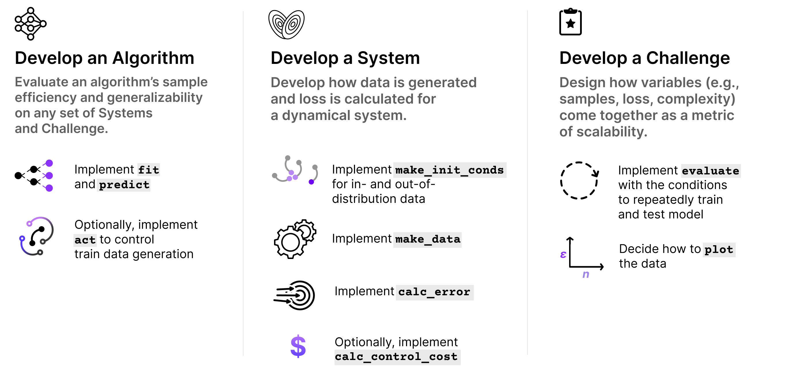
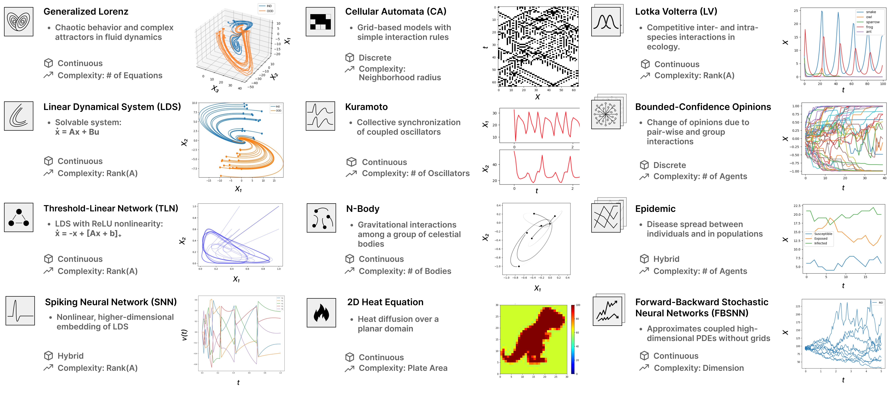
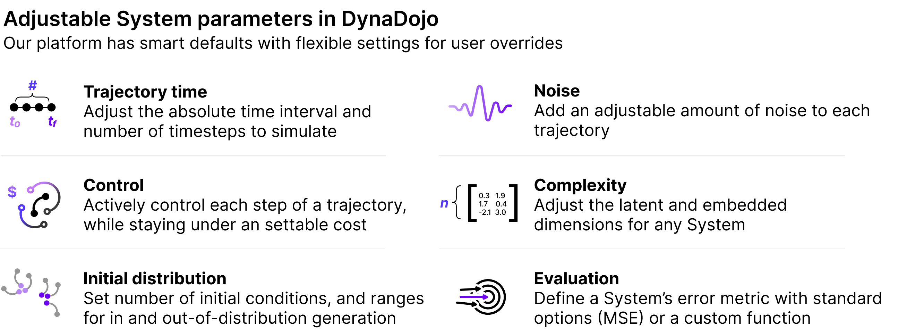
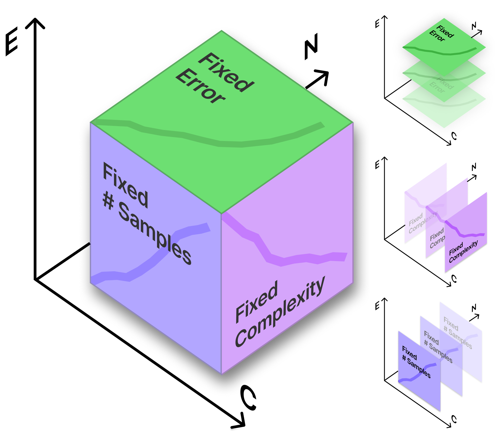

=================
User Guide
=================

Systems
========
DynaDojo systems represent dynamical systems. They generate datasets of trajectories for DynaDojo algorithms to train and predict.

They are also highly tunable.

Algorithms
===========

DynaDojo algorithms train on data generated from DynaDojo systems.

Challenges
===========

DynaDojo challenges benchmark how DynaDojo algorithms perform on DynaDojo systems. Developers can implement their own challenges or use our off-the-shelf challenges to benchmark a range of metrics.

